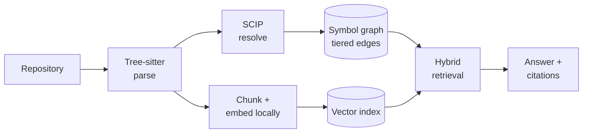

<div align="center">

# RepoMind

**Repository intelligence that runs on your machine.**

Ask questions about an unfamiliar codebase and get answers that cite their sources —
without your code ever leaving your laptop.

[](docs/implementation-plan.md)
[](pyproject.toml)
[](docs/)
[](LICENSE)

[Design](docs/design.md) · [Features](docs/features.md) · [Plan](docs/implementation-plan.md) · [Contributing](CONTRIBUTING.md)

</div>

---

> [!IMPORTANT]
> **Pre-implementation.** This repository currently contains specifications, architecture, and
> tooling — not working software. Nothing is installable yet.
>
> The design is complete and validated; implementation begins at ticket
> [`RM-010`](docs/implementation-plan.md#m1--index-a-python-repo-days-13). Command examples below
> describe the **specified interface**, not shipped behaviour. This banner comes down when v1.0
> ships.

---

## The problem

Understanding existing code — not writing new code — is the dominant cost of joining an unfamiliar
codebase. Before making a one-line change you have to work out how the project is structured,
where functionality lives, how modules interact, and what a change might break. Documentation
helps, until it drifts.

Good tools exist for this. They share one constraint: **they upload your entire codebase to
someone else's servers.**

That follows from their business models, not from oversight. It also rules them out for
proprietary work, regulated industries, and anyone who would simply rather not.

## What makes RepoMind different

| | Private repos | Self-hostable | **Whole repo uploaded** | Cost |
|---|:---:|:---:|:---:|---|
| DeepWiki | Subscription | ✗ | **Yes** | Free (public only) |
| Greptile | ✓ | ✗ | **Yes** | ~$30/seat/mo |
| Sourcegraph | ✓ | Enterprise | **Yes** | ~$16k/yr |
| Copilot / Cursor | ✓ | ✗ | **Yes** | Subscription |
| **RepoMind** | **✓** | **✓** | **No — index is always local** | **Free, OSS** |

Read that third column precisely. RepoMind can call a hosted model if you want it to — the
distinction is that **your whole repository is never uploaded or indexed remotely.** Only the
specific snippets relevant to the question you asked, to a provider you chose, when you ask it.

Three properties follow, and each is something the incumbents' business models prevent them
from offering:

- **🔒 Local by default** — parsing, symbol resolution, and embeddings all run on your machine.
  Indexing needs no LLM and makes no network calls at all, verified by test.
- **🔍 Auditable answers** — every claim cites a `file:line` span, and every citation is validated
  before you see it. A citation that doesn't resolve is dropped, not shown.
- **🧩 Bring your own intelligence** — your editor's model, your API key, a local model, or none.

---

## How it works



Everything left of the answer runs locally and needs no model. RepoMind deliberately performs
**no LLM summarization at index time** — which is precisely why cloud tools must upload
everything, and why this one doesn't have to.

### Confidence tiers

Static analysis of a dynamic language is never complete. Rather than hiding that, RepoMind labels
how every relationship was determined and **never merges the tiers**:

| Tier | Source | How to read it |
|---|---|---|
| `resolved` | Type-aware indexer (SCIP) | A fact |
| `heuristic` | Name and scope matching | Probably right |
| `inferred` | Model-proposed *(not emitted in v1)* | A lead, not a fact |

So impact analysis reports **"4 definitely affected, 9 possibly affected"** rather than one
undifferentiated list that invites misplaced confidence.

This is also what makes the tool honest when its dependencies fail: if the SCIP indexer is
unavailable, the `resolved` tier is simply empty and every surface says so. An incomplete graph is
fine. An incomplete graph that *looks* complete is not.

---

## Usage

> Specified interface — see the status note above.

```bash
pipx install repomind
repomind index .
```

```bash
# Ask, and get citations back
repomind ask "what happens during user login?"

# What breaks if I change this?
repomind refs app.auth.verify_token --depth 2

# What does my current diff affect, and which tests cover it?
repomind impact --tests-only

# Scoped diagram — never a whole-repo hairball
repomind graph app.auth --radius 2 --format mermaid

# See exactly what would be sent before anything is sent
repomind ask "how is caching configured?" --dry-run
```

### Four ways to run it

| Mode | Answers come from | Repo uploaded | Cost | Needs |
|---|---|:---:|---|---|
| **MCP** *(recommended)* | Your editor's existing model | No | **Nothing extra** | Claude Code / Cursor |
| **Your API key** | Any provider you choose | No | Your API usage | An API key |
| **Fully local** | Ollama / llama.cpp | No | Free | 8 GB+ RAM |
| **No LLM** | — | No | Free | Nothing |

**MCP mode inverts the problem.** Running as an MCP server inside an agentic editor, RepoMind
returns retrieved context, citations, and graph paths as tool results — and the host's model does
the synthesis. No API key, no local model, no extra cost.

**The no-LLM floor is higher than you'd expect.** Search, symbol lookup, reverse dependencies,
impact analysis, and diagrams all work with no model at all. Only prose synthesis needs one, which
makes the LLM a genuinely pluggable component rather than a foundation.

---

## Evaluation

Most tools in this space publish no evaluation whatsoever. RepoMind treats that as a defect, not a
norm — its harness is built during the first month, not bolted on afterwards.

- **Golden-set Q&A** — 60–80 hand-labelled questions across real repositories, measuring retrieval
  precision and recall **per confidence tier**, against vector-only, keyword-only, and grep+LLM
  baselines.
- **Historical PR replay** — ground truth already exists in git history. Seed impact analysis with
  one file from a merged PR, predict the rest, compare against what actually changed. Hundreds of
  real PRs, fully automated, no human labelling.

Results — **including where it performs badly** — ship in this README at v1.0. A tool asking you
to trust its answers should show its own numbers first.

---

## Roadmap

Value is monotonic: every cut line falls at the end, so the tool is useful before it is complete.

| | Milestone | Delivers |
|---|---|---|
| **Day 16** | Working, evaluated tool | Python indexing, search, grounded Q&A, reverse deps, CLI + MCP, published eval numbers |
| **Day 22** | Differentiated | TypeScript, change-impact analysis, PR-replay evaluation |
| **Day 26** | Visual | Local web UI with interactive React Flow graphs |
| **Day 30** | 🚀 **v1.0 public release** | Hardened, packaged, documented |
| Days 31–60 | v1.1 | Distribution, hardening from real usage, documentation generation, repository health |

Full ticket breakdown with dependencies and exit criteria in
[`docs/implementation-plan.md`](docs/implementation-plan.md).

---

## Documentation

This project was specified before it was built, and the reasoning is public — including the parts
that argue against it.

| Document | What's in it |
|---|---|
| [`docs/project-document.md`](docs/project-document.md) | Validation, positioning, scope, risks. Includes the competitive analysis that nearly killed the idea |
| [`docs/design.md`](docs/design.md) | Architecture, data model, and **nine architectural decisions** — each with alternatives considered and trade-offs accepted |
| [`docs/features.md`](docs/features.md) | 28 features with requirements, dependencies, and priorities. Deferred features carry unlock conditions; one is explicitly rejected, with reasons |
| [`docs/implementation-plan.md`](docs/implementation-plan.md) | Milestones, ~45 tickets, testing and deployment strategy, risk register |
| [`docs/conventions.md`](docs/conventions.md) | Code conventions |
| [`AGENTS.md`](AGENTS.md) | Instructions for AI agents — invariants, scope discipline, commit hygiene |

### Invariants

Six properties hold across the whole system. Each traces to a product commitment, and each is
enforced by a test in `tests/invariants/` rather than by good intentions:

1. Indexing never touches the network
2. No LLM runs at index time
3. Confidence tiers never merge
4. `deny_remote` cannot be overridden by any config layer or flag
5. Every retrieval path works with no LLM configured
6. Nothing is written inside the repository being indexed

---

## Contributing

Contributions are welcome — see [CONTRIBUTING.md](CONTRIBUTING.md).

Right now the most valuable contribution is **a critique of the plan**. If something in
[`docs/design.md`](docs/design.md) is wrong, saying so before it is built is worth far more than
fixing it afterwards. The design records its alternatives specifically so it can be argued with.

## License

[Apache-2.0](LICENSE). Chosen for its explicit patent grant and because corporate legal teams
approve it without friction — which matters when your users are often reading code at work.

## Acknowledgements

A college club project. Original concept and problem framing by **Sanjeev P S**; see
[CONTRIBUTORS.md](CONTRIBUTORS.md).

Built on [Tree-sitter](https://tree-sitter.github.io/), [SCIP](https://sourcegraph.com/docs/code-search/code-navigation/writing_an_indexer),
[sqlite-vec](https://github.com/asg017/sqlite-vec), and the
[Model Context Protocol](https://modelcontextprotocol.io/).
