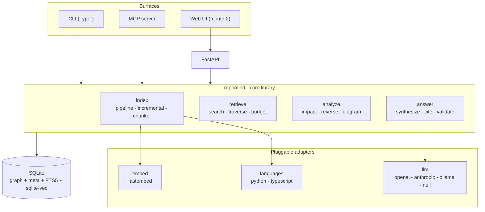
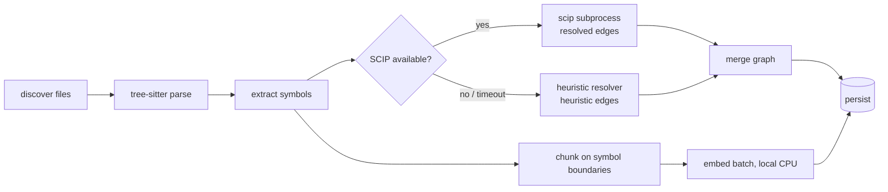
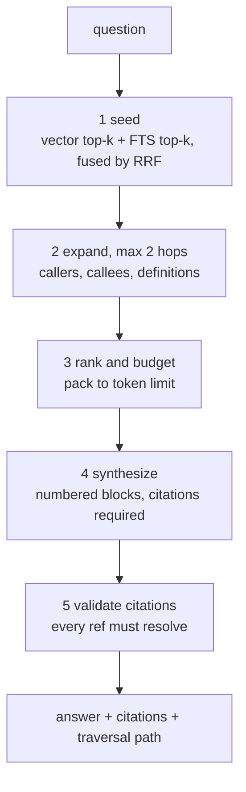
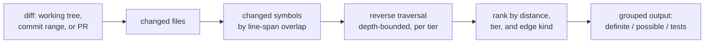

# RepoMind — System Design (Phase 2)

| | |
|---|---|
| **Document** | Phase 2 — system and product design |
| **Depends on** | [`project-document.md`](project-document.md) (Phase 1, validated) |
| **Status** | Draft for approval |
| **Not included** | Feature specification (Phase 3), implementation plan (Phase 4) |

---

## 1. Design constraints

Carried from Phase 1, all binding:

| Constraint | Design consequence |
|---|---|
| Index is local, unconditionally | No network calls in the indexing path — enforced by test, not convention (§9.1) |
| No LLM at index time | Chunking and embedding are deterministic and free |
| Confidence tiering in the schema from day one | `tier` is a column on every edge, not a derived property (§4.3) |
| Sole developer, ~30 days to v1.0 | One datastore, two languages, no service mesh |
| Moderate repos now (~5k files), large later | Storage behind protocols; no in-memory whole-graph operations (§11) |
| Four run modes including no-LLM | The LLM is a leaf dependency, never a foundation (§7.4) |

**Decisions confirmed 2026-09-09:**

| # | Decision | Recorded as |
|---|---|---|
| 1 | Primitives for MCP, bounded loop for CLI | AD-6 |
| 2 | Central index at `~/.repomind/`, keyed by repo | AD-5 |
| 3 | Graph-only impact analysis in v1 | AD-7 |

---

## 2. Architecture overview



**The load-bearing idea: the library is the product.** The CLI imports it directly — no daemon, no localhost server, no port to remember. The MCP server imports it. Only the web UI needs an HTTP layer, and that layer is a thin translation over the same calls.

This is what makes `pipx install repomind && repomind index .` work as one step, and it is why the web UI costs 4 days rather than 8: by the time it is built, its backend already exists for the MCP server.

---

## 3. Module breakdown

```
repomind/
├── config.py            Layered config resolution (§6.4)
├── workspace.py         Index location, repo identity, advisory locking
├── model.py             Core dataclasses: Symbol, Edge, Chunk, IndexRun
│
├── ingest/
│   ├── discover.py      File walk, .gitignore, vendor/generated filters, size caps
│   └── git.py           SHA resolution, diff sets, blob hashes
│
├── languages/
│   ├── base.py          LanguagePack protocol — the only extension point per language
│   ├── python/          tree-sitter queries + scip-python runner
│   └── typescript/      tree-sitter queries + scip-typescript runner
│
├── store/
│   ├── base.py          GraphStore / VectorStore protocols (§11.3)
│   └── sqlite/          schema.sql, graph.py, vectors.py, fts.py
│
├── index/
│   ├── pipeline.py      discover → parse → resolve → chunk → embed → persist
│   ├── incremental.py   SHA diff, invalidation, neighbour recompute
│   └── chunker.py       Symbol-boundary chunking
│
├── embed/               Protocol + local fastembed implementation
│
├── retrieve/
│   ├── search.py        Vector + FTS5, fused by RRF (AD-8)
│   ├── traverse.py      Bounded graph expansion, tier-filtered
│   ├── budget.py        Token-budgeted context packing
│   └── pipeline.py      The bounded CLI loop (AD-6)
│
├── analyze/
│   ├── reverse.py       Reverse-dependency queries
│   ├── impact.py        Change impact from a diff (graph-only, AD-7)
│   └── diagram.py       Subgraph selection + Mermaid emission
│
├── llm/
│   ├── base.py          Provider protocol
│   ├── openai.py  anthropic.py  ollama.py  null.py
│   └── egress.py        Redaction, dry-run preview, deny_remote enforcement (§9)
│
├── answer/
│   └── synthesize.py    Prompt construction, citation validation (§6.2)
│
├── eval/
│   ├── qa.py            Golden-set harness
│   ├── replay.py        Historical-PR replay
│   └── report.py        Metrics, per-tier breakdown
│
├── cli/                 Typer commands
└── mcp/                 MCP tool definitions
```

**Dependency rule, enforced by `import-linter` in CI:** `surfaces → core → adapters → store`. Nothing in `store/` or `languages/` may import from `retrieve/` or `answer/`.

This is what keeps the storage swap in §11.3 a real option rather than an aspiration. Layering that is not mechanically checked decays within weeks.

---

## 4. Data model

### 4.1 Files and modules are symbols

Files and modules are `symbol` rows with `kind IN ('file','module')`, not a separate node type.

The alternative — separate `file` and `symbol` tables — forces every edge to be polymorphic, because module-level code genuinely does reference things: a bare `import x` at the top of a file belongs to no function. Polymorphic edges mean either two nullable foreign keys plus a discriminator, or two edge tables. Both are worse than modelling a module as what it already is in Python: a symbol that contains other symbols.

### 4.2 Schema

```sql
CREATE TABLE repo (
    id            INTEGER PRIMARY KEY,
    root_path     TEXT NOT NULL UNIQUE,   -- absolute, normalised
    remote_url    TEXT,
    indexed_sha   TEXT,                   -- the commit this index describes
    indexed_at    TEXT,
    scip_status   TEXT                    -- ok | degraded | skipped
);

CREATE TABLE file (
    id            INTEGER PRIMARY KEY,
    repo_id       INTEGER NOT NULL REFERENCES repo(id) ON DELETE CASCADE,
    path          TEXT NOT NULL,          -- repo-relative, forward slashes
    lang          TEXT NOT NULL,
    blob_sha      TEXT NOT NULL,          -- content hash: drives incremental invalidation
    n_lines       INTEGER,
    UNIQUE (repo_id, path)
);

CREATE TABLE symbol (
    id             INTEGER PRIMARY KEY,
    repo_id        INTEGER NOT NULL REFERENCES repo(id) ON DELETE CASCADE,
    file_id        INTEGER NOT NULL REFERENCES file(id) ON DELETE CASCADE,
    kind           TEXT NOT NULL,         -- file|module|class|function|method|variable
    name           TEXT NOT NULL,
    qualified_name TEXT NOT NULL,         -- pkg.mod.Class.method
    scip_symbol    TEXT,                  -- SCIP global id; NULL when unresolved
    start_line     INTEGER NOT NULL,
    end_line       INTEGER NOT NULL,
    signature      TEXT,
    docstring      TEXT
);
CREATE INDEX idx_symbol_qname ON symbol(repo_id, qualified_name);
CREATE INDEX idx_symbol_scip  ON symbol(repo_id, scip_symbol) WHERE scip_symbol IS NOT NULL;
CREATE INDEX idx_symbol_file  ON symbol(file_id);

-- The central table. Tier is first-class, never derived.
CREATE TABLE edge (
    id               INTEGER PRIMARY KEY,
    repo_id          INTEGER NOT NULL REFERENCES repo(id) ON DELETE CASCADE,
    src_symbol_id    INTEGER NOT NULL REFERENCES symbol(id) ON DELETE CASCADE,
    dst_symbol_id    INTEGER NOT NULL REFERENCES symbol(id) ON DELETE CASCADE,
    kind             TEXT NOT NULL,       -- calls|imports|inherits|references|defines|tests
    tier             TEXT NOT NULL CHECK (tier IN ('resolved','heuristic','inferred')),
    confidence       REAL NOT NULL DEFAULT 1.0,
    evidence_file_id INTEGER REFERENCES file(id) ON DELETE SET NULL,
    evidence_line    INTEGER,             -- where the relationship is observable in source
    UNIQUE (src_symbol_id, dst_symbol_id, kind, tier)
);
-- Reverse traversal is the hot path: "who depends on X" walks dst -> src.
CREATE INDEX idx_edge_dst ON edge(dst_symbol_id, tier, kind);
CREATE INDEX idx_edge_src ON edge(src_symbol_id, tier, kind);

CREATE TABLE chunk (
    id            INTEGER PRIMARY KEY,
    repo_id       INTEGER NOT NULL REFERENCES repo(id) ON DELETE CASCADE,
    file_id       INTEGER NOT NULL REFERENCES file(id) ON DELETE CASCADE,
    symbol_id     INTEGER REFERENCES symbol(id) ON DELETE CASCADE,  -- NULL: file remainder
    start_line    INTEGER NOT NULL,
    end_line      INTEGER NOT NULL,
    text          TEXT NOT NULL,
    n_tokens      INTEGER NOT NULL
);
CREATE INDEX idx_chunk_symbol ON chunk(symbol_id);

CREATE VIRTUAL TABLE chunk_fts USING fts5(
    text, content=chunk, content_rowid=id, tokenize=unicode61
);

-- chunk_fts is an external-content table: no rows of its own, kept in
-- sync by hand via SQLite's own documented trigger pattern. chunk_vec
-- has the same problem for a different reason: vec0 does not support
-- FOREIGN KEY, so ON DELETE CASCADE cannot reach it -- chunk_ad deletes
-- from it explicitly instead (RM-032, confirmed 2026-09-10). Both
-- file/repo cascades still fire chunk_ad as an ordinary AFTER DELETE.
CREATE TRIGGER chunk_ai AFTER INSERT ON chunk BEGIN
    INSERT INTO chunk_fts(rowid, text) VALUES (new.id, new.text);
END;
CREATE TRIGGER chunk_ad AFTER DELETE ON chunk BEGIN
    INSERT INTO chunk_fts(chunk_fts, rowid, text) VALUES ('delete', old.id, old.text);
    DELETE FROM chunk_vec WHERE chunk_id = old.id;
END;
CREATE TRIGGER chunk_au AFTER UPDATE ON chunk BEGIN
    INSERT INTO chunk_fts(chunk_fts, rowid, text) VALUES ('delete', old.id, old.text);
    INSERT INTO chunk_fts(rowid, text) VALUES (new.id, new.text);
END;

CREATE VIRTUAL TABLE chunk_vec USING vec0(
    chunk_id INTEGER PRIMARY KEY,
    embedding FLOAT[384]                  -- bge-small-en-v1.5
);

-- Observability and resumability, not decoration.
CREATE TABLE index_run (
    id            INTEGER PRIMARY KEY,
    repo_id       INTEGER NOT NULL REFERENCES repo(id) ON DELETE CASCADE,
    started_at    TEXT NOT NULL,
    finished_at   TEXT,
    from_sha      TEXT,
    to_sha        TEXT,
    status        TEXT NOT NULL,          -- running|ok|failed|interrupted
    files_done    INTEGER DEFAULT 0,
    files_total   INTEGER,
    scip_status   TEXT,
    error         TEXT
);
```

### 4.3 Why `tier` is a column, not a score

The obvious alternative is a single `confidence REAL` with a threshold. It is worse, for one specific reason: **the three tiers differ in kind, not in degree.**

A `resolved` edge is a fact from a type-aware indexer. A `heuristic` edge is a name match that is usually right. An `inferred` edge is a language model's guess. Collapsing these onto one axis makes `0.8` uninterpretable — is it a confident guess or a shaky fact? — and it makes the per-tier precision measurement in §10 impossible, which is the measurement that tells you whether heuristic edges are earning their place.

`confidence` survives as a secondary float for ranking *within* a tier. It never crosses tiers.

### 4.4 Traversal, with cycles

Circular imports are common in Python, so the recursive CTE has to terminate by construction rather than by luck:

```sql
WITH RECURSIVE upstream(symbol_id, depth) AS (
    SELECT id, 0 FROM symbol WHERE id IN (/* seeds */)
  UNION                                   -- UNION, not UNION ALL: dedups, breaks cycles
    SELECT e.src_symbol_id, u.depth + 1
    FROM edge e
    JOIN upstream u ON e.dst_symbol_id = u.symbol_id
    WHERE u.depth < :max_depth
      AND e.tier IN (/* selected tiers */)
)
SELECT symbol_id, MIN(depth) AS distance
FROM upstream
GROUP BY symbol_id
ORDER BY distance;
```

`UNION` deduplicates whole rows, so a cycle that revisits a symbol at greater depth still terminates against `max_depth`; `MIN(depth)` then recovers the shortest path. Default depth cap is 4.

---

## 5. Key flows

### 5.1 Indexing



Parsing and embedding run in a process pool. Persistence is batched inside a single transaction per file group so an interrupted run leaves a consistent database, with progress recoverable from `index_run.files_done`.

**No step in this diagram touches the network.** That is asserted by a test that monkeypatches `socket.socket` to raise during a full index run (§9.1).

### 5.2 Answering a question — the bounded loop (CLI)



Step 5 is what turns "show your work" from an intention into a mechanism. The synthesis prompt numbers every context block; the model must cite block numbers; the validator maps each cited block back to a real `file:line` span. **A citation that does not resolve is dropped and the answer is flagged as partially unverified** rather than shown as if it were sound.

Under MCP (mode A) steps 1–3 are exposed as tools and the host performs its own loop. Steps 4–5 do not run at all — the host synthesises, so RepoMind never duplicates the reasoning or the token spend.

### 5.3 Change impact



Mapping changed *lines* to changed *symbols* by span overlap is what makes this precise rather than file-level. A one-line change inside one method seeds one symbol, not the whole file.

Tests are identified two ways: by convention (`test_*.py`, `*_test.py`, `tests/`) and by `tests` edges where a test symbol references a source symbol. Convention finds the file; the graph tells you which tests actually touch the changed code.

---

## 6. Interfaces

### 6.1 Library API — the primary surface

```python
from repomind import Repo

repo = Repo.open("/path/to/project")        # or Repo.index(path) to build
repo.search("where is authentication handled")     -> list[SearchHit]
repo.symbol("app.auth.login")                      -> Symbol
repo.references_to(sym, tiers=("resolved",))       -> list[Reference]
repo.impact_of(diff, max_depth=3)                  -> ImpactReport
repo.subgraph(sym, radius=2, max_nodes=40)         -> Subgraph
repo.ask("what happens during login")              -> Answer   # needs a provider
```

Every method except `ask` works with no LLM configured — that is mode D, and it is a property of the API shape rather than a feature flag.

### 6.2 Answer object

```python
@dataclass
class Answer:
    text: str
    citations: list[Citation]      # file, start_line, end_line, block_id
    traversal: list[GraphStep]     # which edges were followed, with tiers
    unverified_claims: list[str]   # citations that failed validation
    cost: CostReport               # tokens in/out, estimated price, provider
```

`unverified_claims` is deliberately part of the return type rather than a log line. A caller cannot render an answer without being handed the parts of it that did not check out.

### 6.3 CLI

```
repomind index [PATH] [--no-scip] [--force]
repomind ask "question" [--provider ...] [--dry-run] [--json]
repomind refs SYMBOL [--tier resolved|heuristic|inferred] [--depth N]
repomind impact [--staged | --range A..B] [--tests-only]
repomind graph SYMBOL [--radius 2] [--format mermaid|json]
repomind list                       # indexed repos — the answer to "where did it go"
repomind status [PATH]              # SHA drift, SCIP status, counts, index size
repomind serve --mcp | --http
```

`repomind list` and `status` exist specifically to pay down the one real cost of central storage (AD-5): the index is not visible in the repo, so discovery needs a command.

### 6.4 Configuration layering

Lowest to highest precedence: built-in defaults → `~/.repomind/config.toml` → `<repo>/.repomind/config.toml` → environment → command-line flags.

**One exception, and it is deliberate: `deny_remote = true` cannot be overridden by any higher layer.** A repo-level policy that forbids egress must not be defeatable by a flag, or it is not a policy. This is the only asymmetry in the layering, and it exists so a tech lead can commit a lock that holds.

### 6.5 MCP tools

| Tool | Purpose |
|---|---|
| `search_code` | Hybrid search, returns ranked chunks with spans |
| `get_symbol` | Definition, signature, docstring, span |
| `find_references` | Callers and referrers, tier-filtered |
| `impact_of_change` | Graph-only impact for a diff |
| `render_subgraph` | Scoped Mermaid diagram |
| `repo_status` | SHA, staleness, SCIP status, coverage |

No `ask` tool. Under MCP the host is the reasoner — offering `ask` would invite it to delegate synthesis back to a second model, paying twice and losing the host's own context.

---

## 7. Architectural decisions

Format: decision, alternatives, trade-off, rationale.

### AD-1 — Library-first, surfaces as thin clients

**Chosen:** a Python package with CLI, MCP, and HTTP as thin adapters over it.

**Alternatives:** (a) server-centric, every surface talks HTTP to a local daemon; (b) CLI-centric, other surfaces shell out.

**Trade-offs.** The daemon model gives one code path and easy multi-client state, but forces users to start a server before asking a question, adds port and lifecycle management, and contradicts the one-command install promise. Shelling out from the MCP server means process spawn per call and parsing text output — fragile and slow.

**Why this one:** it is the only option where `repomind ask` works with nothing running. It also makes the web UI cheap later, since the HTTP layer is a translation over calls that already exist.

### AD-2 — SQLite as the single datastore

**Chosen:** one SQLite file per repo, holding graph, metadata, FTS5, and vectors via `sqlite-vec`.

**Alternatives:** (a) the original Neo4j + Qdrant + PostgreSQL + Redis stack; (b) Postgres alone with `pgvector` and recursive CTEs; (c) SQLite plus a separate FAISS index file.

**Trade-offs.** The multi-service stack offers a genuinely better graph query language and proven vector scale, at the cost of five services to install and operate — which contradicts local-first and would not fit the timeline. Postgres alone is a reasonable middle path but still requires a running server. SQLite + FAISS splits durability across two files that can disagree after a crash.

**Why this one:** everything lives in one file that can be deleted, copied, or backed up trivially; there is no server, no port, no daemon; and transactions span graph and vector writes together, so a crash cannot desynchronise them. §11.3 keeps the exit open.

**Cost accepted:** recursive CTEs are more verbose than Cypher, and brute-force vector search has a ceiling (§11.2).

### AD-3 — Modules as symbols

**Chosen:** one `symbol` table; files and modules are rows in it.

**Alternative:** separate `file` and `symbol` node tables.

**Trade-off:** the split feels tidier but makes every edge polymorphic, because module-level statements reference things while belonging to no function.

**Why this one:** it keeps `edge` a clean symbol-to-symbol relation with two non-null foreign keys, which is what makes the traversal query in §4.4 a single simple CTE.

### AD-4 — Tier as a first-class column

**Chosen:** `tier` enum on every edge, never merged across tiers. Covered in §4.3.

**Why it matters most:** it is what lets SCIP be optional. If SCIP overruns its time-box, the `resolved` tier is simply empty and every consumer already knows how to say so. The degradation is honest by construction rather than by remembering to add a warning.

### AD-5 — Central index at `~/.repomind/` *(confirmed)*

**Chosen:** `~/.repomind/repos/<hash-of-abs-path>/index.db`, plus a registry mapping hashes back to paths.

**Alternative:** `.repomind/` inside the repo.

**Trade-offs.** In-repo storage is discoverable and travels with a copied directory, but pollutes repos you may not own, requires a `.gitignore` entry in every project, and breaks on read-only checkouts — which is exactly the reviewing-unfamiliar-code case. Central storage costs discoverability.

**Why this one:** it never writes to a repo, which matters because the primary user is often exploring code they do not own. `repomind list` and `repomind status` (§6.3) repay the discoverability cost directly.

### AD-6 — Primitives for MCP, bounded loop for CLI *(confirmed)*

**Chosen:** MCP exposes retrieval primitives and lets the host agent drive; the CLI runs its own retrieve → expand → synthesize loop, capped at two hops.

**Alternatives:** (a) single-shot RAG everywhere; (b) a full agentic loop inside RepoMind regardless of surface.

**Trade-offs.** Single-shot is simplest and cheapest but weak on multi-hop questions such as "what happens during login," which need following a chain. A full internal loop gives the strongest standalone answers but is slow, expensive, and largely redundant under an already-agentic host — you would pay two models to do one job.

**Why this one:** it matches each surface to what it actually has. The host has a reasoner; give it primitives. The CLI does not; give it a bounded loop with a predictable cost ceiling.

**Cost accepted:** two retrieval code paths. Mitigated by both calling the same `retrieve/` functions — only the orchestration differs.

### AD-7 — Graph-only impact analysis in v1 *(confirmed)*

**Chosen:** deterministic traversal from changed symbols. No LLM in the impact path.

**Alternatives:** (a) LLM semantic layer from the start; (b) graph-only permanently.

**Trade-offs.** An LLM layer would catch coupling the graph cannot see — config-driven wiring, dynamic dispatch, implicit contracts — which in Python is a real fraction of the total. But it introduces fabrication risk into the one feature where a wrong answer is actively harmful, costs money per query, and muddies evaluation: you could no longer tell whether the graph or the guess produced a hit.

**Why this one:** it is the version that can be *measured*. PR replay (§10.2) gives a recall number for pure traversal. If that number is unacceptable, month 2 adds inference with a known baseline to beat. Shipping the inference layer first would mean never learning what the graph alone was worth.

### AD-8 — Hybrid retrieval fused by Reciprocal Rank Fusion

**Chosen:** vector top-k and FTS5 BM25 top-k, combined by RRF: `score = Σ 1/(60 + rank_i)`.

**Alternatives:** (a) vector search alone; (b) weighted score blending; (c) a cross-encoder reranker.

**Trade-offs.** Vector-only fails on exact identifiers — searching `AuthMiddleware` should not depend on embedding similarity. Weighted blending requires normalising two incomparable score distributions and retuning whenever the embedding model changes. A cross-encoder gives the best ranking but adds a second model, latency, and memory on machines chosen for having little.

**Why this one:** RRF uses only ranks, so it needs no normalisation and no tuning, and it degrades gracefully when one retriever returns nothing. It is the strongest option that costs no extra model.

### AD-9 — SCIP as an optional subprocess

**Chosen:** run `scip-python` as a subprocess with a timeout; parse the emitted `index.scip` protobuf; on failure, fall back to the heuristic resolver and record `scip_status='degraded'`.

**Alternatives:** (a) require SCIP; (b) write our own type inference; (c) use Jedi in-process.

**Trade-offs.** Requiring SCIP means one flaky external tool can make the product unusable on a given repo. Writing our own resolver is a multi-month project on its own. Jedi is in-process and simpler, but slower per-symbol across a whole repo and weaker on cross-package resolution.

**Why this one:** it bounds the schedule risk that §14 of the project document names as High. The two-day time-box has a defined outcome rather than an open-ended debugging session, and AD-4 makes the degraded state truthful rather than silent.

**Security consequence, stated plainly:** SCIP indexers execute in the target repository and may import its code or run its tooling. **Indexing an untrusted repository with SCIP enabled is equivalent to running that repository's build.** `--no-scip` must be documented for untrusted code, not buried (§9.3).

---

## 8. AI/ML components

| Component | Choice | Notes |
|---|---|---|
| Embeddings | `bge-small-en-v1.5`, 384-dim | 33M params, CPU, ~15ms/chunk. Local on any machine |
| Chunking | Symbol boundaries, not fixed windows | A function is the natural retrieval unit; fixed windows split bodies mid-logic |
| Tokenizer | `tiktoken` for budgeting | Approximate for non-OpenAI providers; adequate for budget arithmetic |
| Synthesis | Pluggable (§9.4 of project doc) | Never invoked during indexing |
| Reranking | None in v1 | RRF is sufficient; a cross-encoder is a month-2 experiment gated on eval |

**Chunk sizing.** Target 200–800 tokens. Symbols shorter than 50 tokens merge with their parent scope so a three-line helper is not its own retrieval unit. Symbols longer than 800 tokens split at statement boundaries with signature and docstring repeated in each part, so every chunk stays self-describing.

**On the embedding model.** English-biased and code-imperfect, but it runs anywhere, which is the binding requirement. §11 of the project document forbids solving quality problems here with API embeddings, since that would upload the repo and forfeit the product's only structural advantage.

---

## 9. Security

### 9.1 The no-egress-at-index-time invariant

Asserted by a test that patches `socket.socket` to raise for the duration of a full index run. Convention would rot; a failing test does not.

### 9.2 Egress control

Every provider call passes through `llm/egress.py`, which in order: enforces `deny_remote` (§6.4, non-overridable); redacts `.env` contents, gitignored files, and high-entropy strings matching known key formats; renders the exact payload when `--dry-run` is set; records tokens and estimated cost.

Redaction runs on the assembled payload rather than at retrieval, so nothing added later in the pipeline can bypass it.

### 9.3 Untrusted repositories

Two distinct exposures, both documented in the README rather than in a footnote:

1. **SCIP subprocess execution** (AD-9) — indexing an untrusted repo with SCIP enabled runs that repo's tooling. `--no-scip` is the safe mode.
2. **Prompt injection via source code** — comments and docstrings in an indexed repo become model context. RepoMind treats retrieved code strictly as data: the synthesis prompt marks context blocks as untrusted content, and RepoMind takes no action based on their contents. It only ever answers.

### 9.4 Secrets and surfaces

API keys resolve from OS keyring first, then environment, and are never written to any config file the tool creates. The MCP and HTTP servers bind `127.0.0.1` only, with no authentication and therefore no remote binding option. Path handling refuses writes outside the workspace directory.

---

## 10. Evaluation harness

Design implications of the strategy already agreed in Phase 1.

### 10.1 Golden-set Q&A
Questions and expected source files stored as YAML under `eval/datasets/`. The runner executes retrieval only — no LLM — for reproducibility and zero cost, measuring file-level precision and recall at k. A separate opt-in mode measures citation validity end-to-end with a provider configured.

### 10.2 Historical PR replay
For each merged PR: check out the parent commit, index it into a throwaway workspace, seed impact analysis with one changed file, and compare predictions against the actual changeset. Reported as precision and recall **broken down per tier**, against a same-directory baseline.

This is why `Repo.index()` must accept an arbitrary destination rather than always writing to the central location — the eval harness needs disposable indexes at historical commits, and the main index stores only one SHA (§4.2).

---

## 11. Scalability

### 11.1 Targets

| | v1 target | Design ceiling |
|---|---|---|
| Files | ~5,000 | 50,000 |
| Symbols | ~50,000 | 500,000 |
| Chunks | ~80,000 | 800,000 |
| Full index | < 5 min | — |
| Incremental | < 5 s typical commit | — |
| Query p95 | < 500 ms (no LLM) | — |

### 11.2 The known ceiling

`sqlite-vec` is brute force: every query scans all vectors. At 80k chunks × 384 dims that is roughly 30–60 ms — comfortable. At 800k it approaches 500 ms and becomes the dominant cost.

**This is the first thing that will break at scale, and it is a known quantity rather than a surprise.** The trigger for acting is measured p95 above 500 ms, not a guess. The response is an ANN index (Qdrant, or FAISS behind the same protocol), not a rewrite.

### 11.3 Keeping the exit open

`GraphStore` and `VectorStore` protocols in `store/base.py` are the seam. Rules that keep it real: no raw SQL outside `store/sqlite/`; no query returns an unbounded result set; nothing loads the whole graph into memory. Combined with the import-linter rule in §3, swapping the backend stays an implementation change.

### 11.4 Indexing throughput
Parsing parallelises across a process pool. Embedding batches at 32 chunks. Both checkpoint into `index_run`, so an interrupted index resumes rather than restarts — which matters most on exactly the large repos where it hurts.

---

## 12. Failure handling

| Failure | Behaviour |
|---|---|
| SCIP times out or errors | Fall back to heuristic tier, set `scip_status='degraded'`, warn once at index time and again in `repomind status`. Not silent |
| Embedding model download fails | Fail with the manual download path and cache location. Indexing without embeddings is not a useful partial state |
| Index interrupted | `index_run.status='interrupted'`; next run resumes from `files_done` |
| Corrupt or schema-mismatched DB | Detected by a `schema_version` pragma; prompt for `--force` reindex rather than migrating silently |
| Repo not a git repository | Index from the filesystem; incremental updates disabled with a clear reason |
| SHA drift since indexing | Every answer footers the indexed SHA; `status` shows drift; `ask` warns above a threshold |
| LLM provider error | Retry with backoff, then **degrade to mode D** — show retrieved context and citations without synthesis. Never a bare stack trace |
| Concurrent index of one repo | Advisory lock file in the workspace; second process reports which PID holds it |

The LLM failure path is the one worth noting: because every retrieval step works without a model, provider failure degrades to a strictly less useful but still correct result. Mode D is both a product mode and the universal fallback.

---

## 13. Infrastructure and external services

**Runtime dependencies:** none. No database server, no queue, no cloud account.

**Build-time and optional:** `scip-python` and `scip-typescript` (Node-based, invoked as subprocesses, optional); a model file from HuggingFace on first run, cached locally; whichever LLM provider the user configures, or none.

**Distribution:** PyPI via `pipx`. Node tooling for SCIP is detected at runtime and its absence degrades rather than fails. CI is GitHub Actions: lint, types, tests, import-linter, and the eval suite on a fixed corpus so retrieval regressions surface as failures rather than as vibes.

---

## 14. Open design risks

| Risk | Assessment |
|---|---|
| `sqlite-vec` maturity | Newest dependency in the stack. Isolated behind `VectorStore`; fallback is FAISS or NumPy brute force, roughly a day's work |
| SCIP protobuf parsing effort | Schema is stable and published, but this is unfamiliar surface area. Inside the 2-day box (AD-9) |
| Heuristic resolver precision unknown | Cannot be predicted, only measured. §10 reports precision per tier from day one — if heuristic edges prove noisy, the honest response is to stop emitting them, not to hide the tier |
| Two-hop expansion may be too shallow | The bound is a guess. Configurable, and the golden set will show whether 2 is right |
| Web UI scope | Not designed here beyond its backend seam. Deliberate: it is the first thing cut, and designing it now would be work at risk |

---

## Phase gate

Phase 2 is complete. No feature specification or implementation plan has been produced.

Visual design artifacts have deliberately **not** been created — per the workflow, those follow approval of this design direction.
