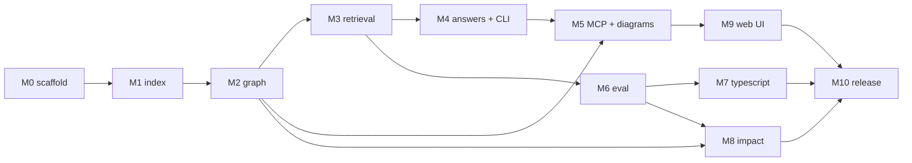

# RepoMind — Implementation Plan (Phase 4)

| | |
|---|---|
| **Document** | Phase 4 — implementation plan |
| **Depends on** | [`project-document.md`](project-document.md) · [`design.md`](design.md) · [`features.md`](features.md) |
| **Timeline** | Two months. **v1.0 ships publicly on day 30** — a commitment, not a target |
| **Team** | Sole developer, AI-assisted, Claude Pro rate limits |

---

## 1. Development phases

| Phase | Days | Outcome |
|---|---|---|
| **M0** — Scaffolding | 0 | Repo, tooling, CI, agent instructions |
| **M1** — Index a Python repo | 1–3 | Symbols in a database |
| **M2** — Tiered graph | 4–6 | Relationships with provenance; graph is queryable |
| **M3** — Retrieval | 7–9 | Hybrid search works |
| **M4** — Answers and CLI | 10–11 | End-to-end question answering |
| **M5** — MCP and diagrams | 12–13 | Usable inside an editor |
| **M6** — Evaluation | 14–16 | **▸ Working, evaluated, usable tool** |
| **M7** — TypeScript | 17–19 | Second language |
| **M8** — Impact analysis | 20–22 | **▸ Differentiated tool** |
| **M9** — Web UI | 23–26 | **▸ Visual** |
| **M10** — Harden and release | 27–30 | **▸ v1.0 public** |
| **M11** — Distribution | 31–35 | Users exist, or we learn why not |
| **M12** — Hardening | 36–42 | Whatever real repos broke |
| **M13** — Documentation generation | 43–47 | F-18 |
| **M14** — Repository health | 48–52 | F-19, F-20 |
| **M15** — Reserved for feedback | 53–56 | Deliberately unallocated |
| **M16** — v1.1 release | 57–60 | |

**Value is monotonic.** Every cut line falls at the end: the tool is useful at M6, differentiated at M8, visual at M9. Anything that slips slips off the bottom.

**Cut order under pressure:** M9 (web UI) → M8 (impact + replay) → M7 (TypeScript). **M6 is never cut.**

---

## 2. Milestones and exit criteria

A milestone is done when its exit criterion is demonstrable, not when its tickets are closed.

| Milestone | Exit criterion |
|---|---|
| M1 | `repomind index .` on a 1k-file Python repo produces symbols with correct spans; no network calls (asserted by test) |
| M2 | `repomind refs <symbol>` returns correct callers on a fixture repo, grouped by tier; cycles terminate |
| M3 | `repomind search` returns relevant results for 10 hand-checked queries in under 500 ms |
| M4 | `repomind ask` answers with citations that all resolve; `--dry-run` shows exact egress |
| M5 | RepoMind answers questions from inside Claude Code via MCP, with no API key configured |
| **M6** | **Published precision/recall on a 40-question golden set, with baselines. This is the credibility gate** |
| M7 | A TypeScript repo indexes and scores comparably on an extended golden set |
| M8 | PR replay reports recall against real changesets, beating the same-directory baseline |
| M9 | Local web UI renders an interactive subgraph and citation-linked answers |
| **M10** | **`pipx install repomind` works on a clean machine in under 5 minutes. Released publicly** |

---

## 3. Ticket breakdown

Estimates are half-day units (0.5 = half a day). `[TB]` marks a time-boxed ticket where the box is the deliverable, not completion.

### M0 — Scaffolding (day 0)

| ID | Title | Features | Depends | Est |
|---|---|---|---|---|
| RM-001 | Package layout, `pyproject.toml`, dependency pins | — | — | 0.5 |
| RM-002 | Tooling: ruff, mypy, pytest, coverage, import-linter | — | RM-001 | 0.5 |
| RM-003 | CI workflow; agent instructions and conventions | — | RM-002 | 0.5 |

### M1 — Index a Python repo (days 1–3)

| ID | Title | Features | Depends | Est |
|---|---|---|---|---|
| RM-010 | Core dataclasses (`Symbol`, `Edge`, `Chunk`, `IndexRun`) | F-1 | RM-001 | 0.5 |
| RM-011 | SQLite schema, `schema_version` pragma, migration guard | F-1 | RM-010 | 1.0 |
| RM-012 | `GraphStore` protocol + SQLite implementation | F-1 | RM-011 | 1.0 |
| RM-013 | Workspace paths, repo registry, advisory locking | F-15 | RM-011 | 0.5 |
| RM-014 | File discovery: gitignore, vendor filters, size caps | F-1 | — | 0.5 |
| RM-015 | Git integration: SHA, blob hashes, diff sets | F-1, F-3 | — | 0.5 |
| RM-016 | `LanguagePack` protocol | F-1, F-4 | RM-010 | 0.5 |
| RM-017 | Tree-sitter Python parser + symbol extraction queries | F-1 | RM-016 | 1.5 |
| RM-018 | Index pipeline orchestration, process pool, checkpointing | F-1 | RM-012, RM-017 | 1.0 |
| RM-019 | **No-network-during-index invariant test** | F-1 | RM-018 | 0.5 |

### M2 — Tiered graph (days 4–6)

| ID | Title | Features | Depends | Est |
|---|---|---|---|---|
| RM-020 | Edge extraction: imports, defines, inherits | F-2 | RM-017 | 1.0 |
| RM-021 | Heuristic resolver: name and scope matching → `heuristic` tier | F-2 | RM-020 | 1.0 |
| RM-022 | `[TB]` SCIP subprocess runner + protobuf ingest → `resolved` tier | F-2 | RM-020 | **2.0 max** |
| RM-023 | Tier merge, `scip_status` reporting, degraded-mode warnings | F-2 | RM-021, RM-022 | 0.5 |
| RM-024 | Reverse traversal: cycle-safe recursive CTE, depth cap | F-7 | RM-012 | 1.0 |
| RM-025 | `repomind list` / `status` / `remove` | F-15 | RM-013 | 0.5 |

**RM-022 is the schedule's single biggest risk.** If the box expires, ship with `resolved` empty, set `scip_status='degraded'`, and move on. The tier mechanism makes that honest rather than broken — this is the whole reason it exists.

### M3 — Retrieval (days 7–9)

| ID | Title | Features | Depends | Est |
|---|---|---|---|---|
| RM-030 | Symbol-boundary chunker with merge/split rules | F-5 | RM-017 | 1.0 |
| RM-031 | `Embedder` protocol + bge-small, batched and resumable | F-5 | RM-030 | 1.0 |
| RM-032 | `VectorStore` protocol + sqlite-vec; FTS5 sync | F-5 | RM-031 | 1.0 |
| RM-033 | Hybrid search with RRF fusion | F-5 | RM-032 | 1.0 |
| RM-034 | Incremental re-index: invalidation + neighbour recompute | F-3 | RM-015, RM-018 | 1.5 |
| RM-035 | Bounded graph expansion for retrieval | F-6 | RM-024, RM-033 | 0.5 |

### M4 — Answers and CLI (days 10–11)

| ID | Title | Features | Depends | Est |
|---|---|---|---|---|
| RM-040 | `Provider` protocol + OpenAI, Anthropic, Ollama, Null adapters | F-13 | — | 1.0 |
| RM-041 | Config layering; **non-overridable `deny_remote`** | F-14 | — | 0.5 |
| RM-042 | Egress guard: redaction, dry-run, cost accounting | F-14 | RM-040, RM-041 | 1.0 |
| RM-043 | Token budgeting and context packing | F-6 | RM-035 | 0.5 |
| RM-044 | Synthesis prompt, numbered blocks, **citation validation** | F-6 | RM-043 | 1.0 |
| RM-045 | CLI: `index`, `ask`, `search`, `refs`, `--json`, exit codes | F-10 | RM-044 | 1.0 |

### M5 — MCP and diagrams (days 12–13)

| ID | Title | Features | Depends | Est |
|---|---|---|---|---|
| RM-050 | Subgraph selection: relevance scoring, node budget, clustering | F-9 | RM-024 | 1.0 |
| RM-051 | Mermaid emission with tier-distinct edge styling | F-9 | RM-050 | 0.5 |
| RM-052 | MCP server: six tools, localhost bind | F-11 | RM-033, RM-024 | 1.5 |
| RM-053 | `repomind graph` CLI command | F-9, F-10 | RM-051 | 0.5 |

### M6 — Evaluation (days 14–16) — never cut

| ID | Title | Features | Depends | Est |
|---|---|---|---|---|
| RM-060 | Harness runner, YAML dataset format, metrics per tier | F-16 | RM-033 | 1.0 |
| RM-061 | Golden set: 40 questions across 3 Python repos | F-16 | RM-060 | 2.0 |
| RM-062 | Baselines: vector-only, FTS-only, grep+LLM | F-16 | RM-060 | 1.0 |
| RM-063 | CI integration on fixed corpus; README results table | F-16 | RM-061 | 1.0 |
| RM-064 | Opt-in end-to-end citation-validity mode | F-16 | RM-044 | 0.5 |

**RM-061 does not compress with AI assistance.** Labelling correct source files for 40 questions is human judgement about real repositories. Budget it honestly.

### M7 — TypeScript (days 17–19)

| ID | Title | Features | Depends | Est |
|---|---|---|---|---|
| RM-070 | Tree-sitter TS/TSX parser + symbol extraction | F-4 | RM-016 | 1.5 |
| RM-071 | `[TB]` scip-typescript integration | F-4 | RM-022 | **1.5 max** |
| RM-072 | Node toolchain detection with graceful absence | F-4 | RM-071 | 0.5 |
| RM-073 | Extend golden set with 20 TypeScript questions | F-16 | RM-061 | 1.5 |
| RM-074 | Verify `LanguagePack` needed no changes outside `languages/` | F-4 | RM-070 | 0.5 |

RM-074 is a real check, not ceremony: if adding a language required edits elsewhere, the protocol is wrong and that finding matters more than the feature.

### M8 — Impact analysis (days 20–22)

| ID | Title | Features | Depends | Est |
|---|---|---|---|---|
| RM-080 | Diff parsing; changed lines → symbols by span overlap | F-8 | RM-015 | 1.0 |
| RM-081 | Impact traversal, ranking, tier-grouped output | F-8 | RM-080, RM-024 | 1.0 |
| RM-082 | Test association: convention + `tests` edges; `--tests-only` | F-8 | RM-081 | 1.0 |
| RM-083 | PR replay harness: historical checkout, throwaway index | F-17 | RM-081 | 1.5 |
| RM-084 | Replay metrics per tier + same-directory baseline | F-17 | RM-083 | 1.0 |

### M9 — Web UI (days 23–26)

| ID | Title | Features | Depends | Est |
|---|---|---|---|---|
| RM-090 | FastAPI layer over the library; static bundle serving | F-12 | RM-052 | 1.0 |
| RM-091 | Next.js shell, search view, source viewer | F-12 | RM-090 | 2.0 |
| RM-092 | React Flow subgraph: pan, zoom, click-to-expand | F-12 | RM-090 | 2.5 |
| RM-093 | Answer view with navigable citations | F-12 | RM-091 | 1.5 |
| RM-094 | Bundle static assets into the wheel | F-12 | RM-091 | 0.5 |

### M10 — Harden and release (days 27–30)

| ID | Title | Features | Depends | Est |
|---|---|---|---|---|
| RM-100 | Real-repo matrix: 10 diverse public repos, record failures | — | all | 1.5 |
| RM-101 | Error-handling audit against the §12 failure table | — | all | 1.0 |
| RM-102 | README with eval numbers **including where it performs badly** | — | RM-063 | 1.0 |
| RM-103 | PyPI packaging, trusted publishing, install smoke test | — | RM-094 | 1.0 |
| RM-104 | Security review: egress paths, SCIP execution warning, keyring | — | RM-042 | 0.5 |
| RM-105 | **v1.0 release** | — | all | 0.5 |

### Month 2 (M11–M16)

Ticketed at milestone granularity — detailed tickets written after M10, when real usage informs them. Specifying them now would be inventing requirements.

| ID | Milestone | Notes |
|---|---|---|
| RM-110 | Distribution: demo on a well-known repo, write-up of eval results, launch posts | The block most likely to be skipped for more building |
| RM-120 | Hardening from real-repo failures | Sized by what M11 surfaces |
| RM-130 | Documentation generation (F-18) | Gated on M6 numbers |
| RM-140 | Circular dependency + duplicate detection (F-19, F-20) | Near-free given the graph |
| RM-150 | **Reserved** — user feedback | If nothing lands here, M11 failed |
| RM-160 | v1.1 release | |

---

## 4. Dependency structure

**The critical path is M1 → M2 → M3 → M4/M6.** Everything after M6 is parallel-ish and cuttable. M2 carries the only hard external dependency (SCIP), which is why it is time-boxed rather than open-ended.

---

## 5. Recommended development order

Three rules, in priority order when they conflict:

1. **Storage before producers, producers before consumers.** The schema is the contract; changing it after five modules write to it is the expensive mistake.
2. **Build the query that proves the data right after building the data.** RM-024 (reverse traversal) lands in M2, immediately after the graph, precisely so graph bugs surface on day 6 rather than day 20.
3. **Make it correct, then fast.** No optimisation before M10, except where a stated performance target is already missed.

**Vertical slice first.** M1 aims for a *thin* end-to-end path — index one file, extract one symbol, store it, read it back — before broadening. A working narrow pipeline on day 1 beats a complete parser with nowhere to put its output on day 3.

---

## 6. Technology stack

Confirmed in design §11; restated for completeness.

| Layer | Choice | Version policy |
|---|---|---|
| Language | Python 3.11+ | 3.11 floor for typing features |
| Parsing | `tree-sitter`, `tree-sitter-python`, `tree-sitter-typescript` | Pinned exact |
| Resolution | `scip-python`, `scip-typescript` (Node subprocesses) | Optional at runtime |
| Storage | SQLite + `sqlite-vec` + FTS5 | Pinned exact — newest dependency |
| Embeddings | `sentence-transformers`, bge-small-en-v1.5 | Pinned |
| LLM | `openai`, `anthropic` SDKs; Ollama over HTTP | Compatible range |
| CLI | `typer` + `rich` | Compatible range |
| Server | `fastapi`, `uvicorn`, MCP SDK | Compatible range |
| Web UI | Next.js, React, TypeScript, Tailwind, React Flow | Pinned via lockfile |
| Tooling | ruff, mypy (strict), pytest, coverage, import-linter | Pinned |

**Not used:** LangChain, LlamaIndex, Neo4j, PostgreSQL, Qdrant, Redis, Celery. Adoption triggers are documented in design §11.3 and project-document §11.

---

## 7. Testing strategy

### 7.1 Layers

| Layer | Scope | Speed |
|---|---|---|
| **Unit** | Pure functions: chunker rules, RRF, span overlap, redaction patterns, CTE builders | ms |
| **Integration** | Full pipeline against fixture repos | seconds |
| **Contract** | import-linter layer rules; protocol conformance for every `LanguagePack`, `Provider`, `Store` | ms |
| **Invariant** | Properties that must never break (§7.3) | seconds |
| **Evaluation** | Retrieval quality on the golden set (F-16) | minutes |

### 7.2 Fixtures

Three synthetic Python repos committed under `tests/fixtures/`, each with hand-written expected symbols and edges: **`simple/`** (10 files, linear imports), **`cyclic/`** (circular imports and inheritance chains — the graph edge cases), **`messy/`** (dynamic imports, decorators, conditional imports, `__getattr__` — deliberately the things SCIP will partly fail on).

`messy/` matters most: it is where the difference between `resolved` and `heuristic` becomes observable, and where honest degradation gets tested rather than assumed.

### 7.3 Invariant tests

Non-negotiable, and each maps to a design commitment:

1. **No network during indexing** — patch `socket.socket` to raise for a full index run.
2. **Tiers never merge** — no query returns results with tier information stripped.
3. **`deny_remote` cannot be overridden** — attempt every config layer and flag; all must fail closed.
4. **Retrieval works without a provider** — full search, refs, impact, and graph suites run with `NullProvider`.
5. **Nothing written inside the indexed repo** — snapshot the repo tree before and after indexing; assert identical.
6. **Citations resolve** — every citation in an answer maps to a real span in the retrieved context.

### 7.4 Standards

Coverage floor 80% on `repomind/` excluding surfaces; no network in any test (blocked globally by a fixture, with opt-in markers for provider tests); deterministic — seeded, frozen clock, no reliance on dict ordering; CI runs everything except provider-dependent tests, which run on demand.

---

## 8. Deployment strategy

**Distribution.** PyPI, installed via `pipx install repomind`. Web UI ships as pre-built static assets inside the wheel, so users need no Node toolchain. SCIP indexers are optional and detected at runtime.

**Versioning.** Semantic versioning, `0.x` until day 30. The database carries a `schema_version` pragma; a mismatch prompts for `--force` reindex rather than migrating silently, because a wrong silent migration is worse than a rebuild that takes five minutes.

**Release process.** Tag → CI builds and tests → publish via PyPI trusted publishing (no long-lived token) → smoke test `pipx install` from PyPI on a clean runner. That smoke test is the gate: a release that cannot be installed did not happen.

**CI.** Every push: ruff, mypy strict, pytest, import-linter, evaluation on the fixed corpus. Evaluation runs in CI because retrieval quality regressions are otherwise invisible until someone notices answers got worse.

---

## 9. Risks and mitigations

| Risk | Likelihood | Impact | Mitigation | Trigger to act |
|---|---|---|---|---|
| **SCIP integration overruns** (RM-022, RM-071) | High | High | Time-boxed; optional by design; tier mechanism makes degradation honest | Box expires — ship degraded |
| `sqlite-vec` immature or buggy | Medium | High | Isolated behind `VectorStore`; FAISS/NumPy fallback ≈ 1 day | Blocking bug in M3 |
| Heuristic resolver too noisy | Medium | Medium | Measured per tier from M6 | Precision below ~70% — stop emitting, do not hide |
| Golden set takes longer than 2 days | Medium | Medium | Ship 30 questions rather than 40; extend later | End of day 15 |
| Web UI overruns | High | Low | First in cut order; sits directly above buffer | Day 26 not done — cut it |
| Claude Pro limits throttle throughput | Medium | Medium | Written-down decisions so context loss between sessions is cheap; batch related work | Persistent mid-milestone stalls |
| Scope creep back toward six pillars | **High** | **High** | Day-30 release date; F-18–F-28 unlock conditions | Any new feature proposed before day 30 |
| Nobody uses it | Medium | High | M11 ring-fenced for distribution | No external indexes by day 45 |

**The two High/High risks are SCIP and scope creep.** SCIP is mitigated architecturally — it can fail without sinking the release. Scope creep has no architectural mitigation; only the release date controls it.

---

## 10. MVP → production evolution

"Production" here means dependable for people who are not the author.

| Stage | Marker | What changes |
|---|---|---|
| **MVP** (day 30) | Works on Python and TypeScript repos of moderate size | Single-user, single-repo, local only |
| **Hardened** (day 42) | Survives 10 diverse real repos without manual intervention | Error paths exercised in reality rather than in fixtures |
| **Sustainable** (day 60) | External contributors can land a change | Docs generated in CI, benchmark published, contribution path proven |
| **Scaled** (conditional) | Query p95 under 500 ms at 50k files | ANN backend swapped in behind `VectorStore` — **triggered by measurement, not anticipation** |
| **Multi-user** (conditional) | Only if local adoption exists | PostgreSQL, auth, tenancy. Conflicts with the zero-upload positioning and needs a deliberate answer first |

Each transition is triggered by evidence, not by a date. That is what keeps the deferred list in features.md §3 from quietly becoming a roadmap.

---

## 11. Definition of done

A ticket is done when: acceptance criteria pass; unit tests cover new logic and integration tests cover new pipeline stages; types check under mypy strict; ruff is clean; import-linter contracts hold; user-visible behaviour is documented; and **no new dependency was added without a note in the PR saying why an existing one was insufficient**.

A milestone is done when its exit criterion in §2 is demonstrable on a real repository — not a fixture.

---

## Phase gate

Phase 4 is complete. All four phases of the workflow are now delivered:
**validation → design → features → implementation plan.**
