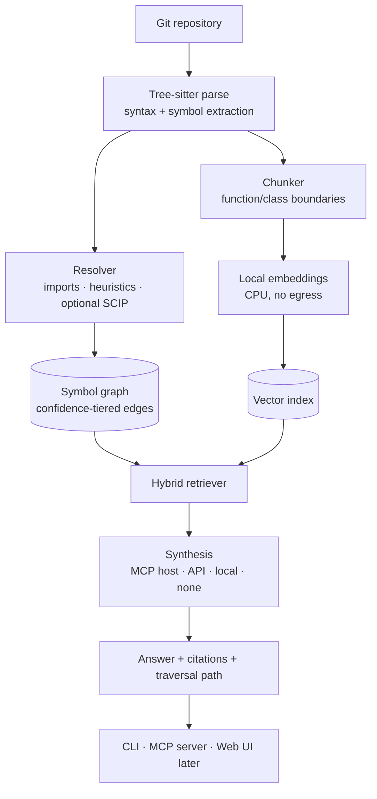

# RepoMind — Project Document (Phase 1 Final)

**Repository intelligence that runs on your machine.**

| | |
|---|---|
| **Document** | Phase 1 final — idea validation and product definition |
| **Supersedes** | Original project idea document (Sanjeev P S) and draft v2 |
| **Date** | 2026-09-09 |
| **Verdict** | **VALIDATED** — conditional on the scope discipline in §7 |
| **Not included** | System design, feature specification, implementation plan — gated behind Phase 2/3/4 approval |

Legend: **[STATED]** from the original document · **[REVISED]** deliberately changed · **[NEW]** added during validation · **[ASSUMPTION]** my inference, flagged for confirmation

---

## 0. Confirmed constraints

Answers given 2026-09-09, now binding on everything below.

| # | Constraint | Consequence |
|---|---|---|
| 1 | **Sole developer (AI-assisted), ~2 months, Claude Pro limits** | *Revised 20 → 30 → 60 days.* **Structured as two releases, not one long build**: v1.0 ships day 30, month 2 responds to real usage (§7.1) |
| 2 | **Moderate repo sizes now; architected for large later** | ~5k files / ~500k LOC target; storage behind interfaces (§12) |
| 3 | **CLI first, web UI after the base is done** | 20-day sprint ships CLI + MCP only |
| 4 | **College club project — license to be chosen** | **Apache-2.0** recommended (§13) |
| 5 | **OpenAI as documented default provider** | README examples use OpenAI; other adapters still ship (§9.5) |

---

## 1. Verdict

# VALIDATED — conditional on scope discipline

The problem is real, the positioning is defensible, and the technical approach is sound. Three conditions, all of which are within your control and all of which are the usual causes of death for projects like this:

1. **v1.0 ships on day 30 regardless of what is finished.** Every previous draft of this idea was too large, and the timeline has now expanded twice. A fixed release date is what converts extra time into *feedback* rather than *scope* (§7.1).
2. **The evaluation harness is built during month 1, not after.** Without it there is no basis for claiming the tool works, and for impact analysis untrustworthy output is worse than none.
3. **Confidence tiering is in the schema from day one.** It cannot be retrofitted, and it is what makes an incomplete graph honest rather than dangerous.

### 1.1 What changed across validation

| Original claim | Finding |
|---|---|
| Incumbents only do code generation and file-level explanation | **False and load-bearing.** DeepWiki auto-generates architecture docs, diagrams, and repo Q&A free for any public repo. The original pitch rested on a gap that has closed |
| Differentiator is bundling six capabilities into one platform | **Not a differentiator.** Bundling is a scope multiplier, not a moat |
| Tree-sitter suffices for dependency and relationship extraction | **False.** Tree-sitter gives syntax, not semantics — it does not resolve imports to definitions or calls to implementations (§8.2) |
| Six capabilities in v1 | **Cut to three, then cut again** to fit 20 days (§7) |
| Five stateful services (Postgres, Neo4j, Redis, Qdrant, Celery) | **Cut to one** (SQLite). Contrary to the positioning and unaffordable in the timeline (§11) |
| No evaluation plan | **Added, and made objective** via historical-PR replay (§10) |
| A separate web platform | **Contradicted the document's own complaint** about tool-switching. Resolved by MCP-first (§9.4) |

### 1.2 What survived, and why the idea is still worth building

The comprehension problem is real, and the incumbents share a constraint they cannot escape: **they are all cloud-hosted, and all require uploading your entire codebase.** That follows from their business models, not from oversight. It is a space they structurally cannot occupy.

That is the opening, and it requires beating nobody.

### 1.3 The honest remaining risks

- **Scope creep, now more than the timeline.** At 60 days the calendar is no longer the binding constraint — discipline is. The control is the day-30 release date (§7.1).
- **Distribution is real work and is not a technical problem.** "Real users" for an OSS dev tool means it must work impressively on a repo people already know, in one command, on first run. Month 2 allocates days 31–35 to it explicitly, because it is the block most likely to be skipped in favour of more building.
- **SCIP integration is the single most likely thing to overrun.** §8.2 time-boxes it and makes it optional by design.

---

## 2. The problem

**[STATED, tightened]** Understanding existing code — not writing new code — is the dominant cost of joining an unfamiliar codebase. Before making even a small change, a developer must work out how the project is structured, where functionality lives, how modules interact, and what a change might break. Documentation helps but drifts as the project evolves. The result is hours or days of manual file-tracing before the first meaningful contribution.

**[REVISED] What this document will not claim.** The original argued that existing tools only handle code generation and file-level explanation. That is no longer true, and no part of this pitch should rest on it. Modern assistants reason across whole repositories, and free tools auto-generate architecture documentation for any public repo.

The comprehension problem is real but **partially served**. The honest gap is not capability. It is **access and trust**.

---

## 3. Where the gap actually is

Three constraints hold across essentially every capable tool in this space:

1. **Your whole codebase is uploaded and indexed on their servers.** Disqualifying for proprietary work, regulated industries, and anyone who simply prefers otherwise.
2. **Private repositories cost money** — per-seat or enterprise-only.
3. **Answers are unverifiable.** You get fluent prose but cannot see what the tool actually looked at, so a correct answer is indistinguishable from a confident wrong one.

| Tool | Private repos | Self-hostable | **Whole repo uploaded & indexed remotely** | Cost |
|---|---|---|---|---|
| DeepWiki | Devin subscription | No | **Yes** | Free (public only) |
| Greptile | Yes | No | **Yes** | ~$30/seat/mo |
| Sourcegraph | Yes | Enterprise | **Yes** | ~$16k/yr, enterprise-only |
| Copilot / Cursor | Yes | No | **Yes** | Subscription |
| **RepoMind** | **Yes** | **Yes** | **No — index is always local** | **Free, OSS** |

**Read the third column precisely.** The distinction is not "does any byte ever reach a third party" — RepoMind supports API-based answering, so it can. The distinction is between **the entire repository uploaded and persistently indexed on someone else's infrastructure** and **transient per-query snippets sent to a provider the user chose**. Those are categorically different exposure profiles, and the difference is architectural rather than a matter of policy (§9.2).

**Positioning:** *the open-source, local-first repository intelligence tool that never uploads your code, and shows its work.*

---

## 4. Users

**[REVISED]** Narrowed from four segments to one primary and one secondary.

**Primary — the developer facing an unfamiliar codebase they cannot or would rather not upload.**
A new hire in week one on a private monorepo. A contractor onboarding to a client's system. A student on a team project. An engineer where third-party AI on source is prohibited. This user has the pain acutely, has **no free option today**, and can install a CLI without asking anyone's permission.

**Secondary — the open-source contributor.** Has free options, but benefits from local speed, editor integration, and citation-backed answers.

**Explicitly out of scope: enterprise buyers.** No SSO, multi-tenancy, compliance posture, or sales motion — because nothing is being sold. This deliberately removes the segment mismatch that made the original framing incoherent.

---

## 5. What RepoMind is, and is not

**In one paragraph.** RepoMind is an open-source tool that builds a structured, queryable model of a codebase **on your own machine** — parsing it into a symbol graph, resolving cross-file relationships, and indexing it for semantic search — so you can ask questions about an unfamiliar repository in natural language and get answers that **cite their sources and show which code paths they traversed**. Indexing is always local and requires no LLM. For answering questions you plug in whatever intelligence you have: your editor's model via MCP, your own API key, a local model, or none at all.

**What it is not** — stated plainly, because scope discipline is the main risk:

- **Not a coding assistant.** It does not write or edit code. Claude Code and Cursor do that well; RepoMind complements them via MCP.
- **Not a documentation site generator.** Deferred (§7.4).
- **Not an enterprise platform.** Single developer or small team, on one machine.
- **Not a DeepWiki competitor.** If your repo is public and you're happy uploading it, DeepWiki is excellent and you should use it.

---

## 6. Design principles

Commitments that constrain later decisions, not aspirations.

1. **The index is local, unconditionally.** No account, no server, no telemetry. `repomind index .` runs fully offline on any machine, with no LLM required. Only *answering* is pluggable.
2. **Show your work — including what you send.** Every answer carries `file:line` citations and the graph path traversed. Every remote call can be previewed before it happens. An answer you cannot verify is not finished, and a privacy claim you cannot check is not a guarantee.
3. **Never fake certainty.** Relationships derived by different means are labelled differently and never silently merged (§9.1).
4. **Meet developers where they work.** The library is the product; CLI, MCP server, and web UI are clients of it.
5. **Earn every dependency.** Each additional service must justify itself against a measured need. Defaults ship as one file.

---

## 7. Scope

### 7.1 Two releases, not one long build

**[REVISED under constraint 1 — third timeline revision]**

The timeline has now moved 20 → 30 → 60 days. That is fine if the time genuinely exists, but it carries the risk this document has flagged three times: **scope creep is the most likely cause of failure, and an expanding timeline is how it normally arrives.** A project without a release date does not ship.

So the approach for two months is **not** "build twice as much before releasing."

> **Ship v1.0 publicly on day 30, exactly as scoped in §7.2. Spend month two responding to reality.**
>
> **[CONFIRMED 2026-09-09]** — accepted as the release model. The day-30 date is a commitment, not a target.

Three reasons this beats a 60-day build:

1. **Distribution is a named risk and is not a technical problem.** It needs calendar time — a README that lands, a demo that works on a repo people recognise, a post that gets read. Building more does not compress it.
2. **Real users invalidate assumptions the eval harness cannot reach.** Whether graph retrieval beats agentic search is measurable in eval; whether anyone *wants* this is not.
3. **A hard release date is the only reliable control on scope creep.** Everything not done by day 30 goes to v1.1 by definition, which removes the judgement call that scope creep exploits.

A tool built in 30 days with 30 days of real user feedback is a substantially stronger project than one built in 60 days with none.

### 7.2 Month 1 — v1.0 (days 1–30), sequenced so value is monotonic

The extra 10 days over the original 20-day plan buy back three things: TypeScript, full impact analysis, and the web UI. They do **not** buy back documentation generation or repository health — those move to month 2 (§7.3), gated on what month 1's evaluation actually shows.

**The organising principle: every cut line falls at the end.** The schedule is ordered so the tool is genuinely useful at day 16, differentiated at day 22, and visual at day 26. Anything that slips slips off the bottom without damaging what sits above it.

| Days | Work | If you fall behind |
|---|---|---|
| 1–3 | Ingestion, Tree-sitter Python parsing, SQLite schema, symbol extraction | Foundation — cannot cut |
| 4–6 | Import graph, heuristic call edges, **confidence tiering**. SCIP **time-boxed to 2 days** | Ship heuristic-tier only (§8.2) |
| 7–9 | Chunking, local embeddings, `sqlite-vec`, hybrid retrieval | Core — cannot cut |
| 10–11 | LLM adapters (OpenAI, Anthropic, Ollama) + CLI | Core — cannot cut |
| 12–13 | MCP server + Mermaid subgraph output | |
| 14–16 | **Evaluation harness + golden set** | **Never cut. This is the credibility of the whole project** |
| | **▸ Day 16: a working, evaluated, usable tool** | |
| 17–19 | TypeScript/JavaScript — `tree-sitter-typescript` + `scip-typescript` | Cut third → v1.5 |
| 20–22 | Full impact analysis + historical-PR replay evaluation | Cut second → v1.5 |
| | **▸ Day 22: a differentiated tool** | |
| 23–26 | Local web UI — Next.js, React Flow, reading the API the MCP server already exposes | **Cut first** → v1.5 |
| 27–30 | Real-repo testing, hardening, docs, buffer | Absorbs overrun |
| | **▸ Day 30: shippable** | |

**Recommended cut order if you slip: web UI → impact analysis → TypeScript. Never the evaluation harness.** A tool with published numbers and no GUI is credible; a pretty tool with no evidence it works is not.

**Why the web UI is only 4 days and still realistic:** by day 22 the FastAPI backend already exists for the MCP server, so the UI is a read-only client over an existing API rather than a new application. Frontend polish still overruns more often than anything else, which is why it sits directly above the buffer.

**Ships in v1 (day 30):**
- Index Python **and** TypeScript/JavaScript repos locally; incremental re-index on later commits
- Natural-language Q&A with citations and traversal paths
- Reverse-dependency queries — "what calls this / what would break if this changed"
- **Change-impact analysis** on a diff, with confidence tiers
- Query-scoped diagrams — Mermaid in CLI, React Flow in the web UI
- CLI, MCP server, and local web UI
- Evaluation harness with published numbers, including historical-PR replay

**[ASSUMPTION]** "30 days, no issues" reads as a soft target rather than a fixed showcase date. If a hard date exists, the cut-line column above is how to hit it.

### 7.3 Month 2 — v1.1 (days 31–60)

Roughly half pre-committed, half deliberately reserved for what month 1 teaches. Ordered by value, not by appeal.

| Days | Work | Rationale |
|---|---|---|
| 31–35 | **Release and distribution** | README, demo on a well-known repo, install path, a written post on the evaluation results. **The highest-value block in month 2** — and the one most likely to be skipped in favour of more building |
| 36–42 | **Hardening on real repos** | Whatever actually breaks in other people's code. Always underestimated; budget it explicitly rather than hoping |
| 43–47 | **Documentation generation** | **Now unlocked.** Its deferral condition was "Q&A retrieval proves reliable" — by day 30 that is known from the eval numbers rather than assumed. Must regenerate in CI, or it inherits the staleness problem it was built to solve |
| 48–52 | **Repository health — the reliable subset only** | Circular dependencies and duplicate logic are near-free once the graph exists. **Dead-code detection stays out** for dynamic languages: it is unreliable in practice and a wrong answer here is worse than none |
| 53–56 | **Reserved — user feedback** | Deliberately unallocated. If the day-30 release produces signal, this is where it gets acted on. If it produces none, that is itself the most important finding of month 2 |
| 57–60 | Buffer, docs, v1.1 release | |

**[NEW] One idea worth considering for the reserved block: publish the benchmark.**

Package the evaluation methodology, golden set, and PR-replay harness as a standalone open benchmark for repository-QA systems. Almost nothing in this space publishes any evaluation at all — being the tool that does is a genuinely defensible position, and it drives distribution better than any feature would. The work is already finished by day 30; this is packaging, not new engineering. Roughly 3 days.

### 7.4 Language order: Python first, then TypeScript

**[REVISED]** Both now ship in v1, but sequenced rather than parallel.

Python first for three reasons: `scip-python` is mature; the analysis code is itself Python, so there is no context-switching cost; and Python's import semantics are simpler to resolve heuristically when SCIP is unavailable.

**TypeScript second, and it inherits the same time-box discipline.** It is a second SCIP integration with the same class of problems — but by day 17 the pattern is proven once, so it should run faster than the first. If it doesn't, it is the third thing to cut.

### 7.5 Still deferred beyond day 60, with explicit re-entry conditions

| Capability | Deferred until |
|---|---|
| **Dead-code detection** | Probably never for dynamic languages. Undecidable in practice; a confident wrong answer here directly contradicts Principle 3 |
| Further languages (Go, Java, Rust) | Python and TypeScript both score well on the eval suite, **and** users ask for a specific one. Each is another SCIP integration — cheaper by the third time, but not free |
| VS Code extension | MCP already covers Claude Code and Cursor. Only worth it if feedback shows users who want neither |
| Scale work — Postgres/Qdrant migration | Users actually hit SQLite limits (§12). Doing this speculatively is how the original scope ballooned |
| Hosted/multi-user version | Local adoption demonstrably exists |

### 7.6 Why diagrams are scoped, never global

Force-directed layout of a thousand-node repository graph produces a hairball that answers no question. CodeSee built precisely this and did not survive. The hard part is **selecting and abstracting the right subgraph**, not rendering. RepoMind draws diagrams only in answer to a question, with a node budget enforced by the renderer.

---

## 8. How it works

### 8.1 Ingestion
Open a local path or clone a remote repo. Respect `.gitignore`, skip vendored and generated directories, cap file sizes. **The index is keyed to a commit SHA**, so it is always answerable which version of the code an answer describes.

### 8.2 The resolution layer — the most important technical correction

**[REVISED]** The original treated Tree-sitter as sufficient for dependency extraction. It is not. Tree-sitter produces a concrete syntax tree per file: it does not resolve imports to definitions, perform type inference, or resolve method calls to implementations. In Python, resolving `obj.handle()` needs type information Tree-sitter does not have.

Two layers doing different jobs:

- **Layer 1 — Tree-sitter (always).** Fast, error-tolerant parsing. Extracts definitions, call sites, imports, docstrings, precise line spans. Excellent at this, used for exactly this.
- **Layer 2 — SCIP (optional, time-boxed).** `scip-python` provides real cross-file resolution with stable global symbol IDs, produced by tooling that actually understands the language.

**[NEW] SCIP is optional by design, and this is what makes the timeline survivable.** A `Resolver` interface has two implementations: `HeuristicResolver` (imports + name/scope matching, always available) and `ScipResolver` (adds the `resolved` tier). If SCIP integration overruns its 2-day box, v1 ships with heuristic edges only and the README says so plainly.

**Confidence tiering is what makes that graceful rather than dishonest** — the system reports what it knows and how it knows it, so a missing `resolved` tier degrades the output's *confidence*, not its *truthfulness*. This is the clearest validation of that design choice.

### 8.3 The graph
Nodes: files, modules, classes, functions, symbols. Edges: `imports`, `calls`, `defines`, `inherits`, `references`, `tests`. Every edge carries provenance and confidence (§9.1).

### 8.4 Retrieval
Hybrid, in three moves: semantic search finds an entry point; graph traversal expands to structurally related code that embeddings would never surface; rerank and budget the context. Structure is what vector search is bad at — *"everything that calls this"* is not a similarity question.

### 8.5 Incremental updates
Re-index only files changed between the indexed SHA and HEAD, plus their direct graph neighbours. Optional git post-commit hook or CI step, so the index tracks the code rather than drifting from it.

---

## 9. Trust: what you can verify, and what leaves your machine

Two halves of one commitment. §9.1 is about not faking certainty. §9.2 onward is about not faking privacy.

### 9.1 Confidence-tiered relationships

**[NEW] The most important idea in the revision.** An incomplete call graph yields confidently wrong impact analysis, which is *actively harmful* rather than merely unhelpful. The fix is not to pretend the graph is complete — it is to **make incompleteness visible and structural.**

Every edge is tagged with how it was obtained:

| Tier | Source | Interpretation |
|---|---|---|
| **Resolved** | SCIP gave a definitive symbol resolution | Trust it |
| **Heuristic** | Name/signature match within scope | Probably right |
| **Inferred** | LLM proposed it from context | A lead, not a fact |

**Tiers are never silently merged.** Output reads *"4 files definitely affected, 9 possibly affected, 3 flagged by inference"* — never one undifferentiated list. The CLI filters by minimum confidence; the UI renders tiers distinctly.

Three things follow, which is why it justifies the schema complexity:

1. **It converts the project's largest correctness risk into a visible feature.**
2. **It makes evaluation tractable** — precision measurable per tier, so it becomes knowable whether heuristic edges pull their weight or add noise.
3. **It is honest**, which for a tool whose purpose is helping people trust unfamiliar code is not a small thing.

### 9.2 The LLM layer — bring your own intelligence

**[REVISED]** An earlier draft implied a local LLM was the privacy-preserving path and API usage a compromise. **That framing was wrong**, and would have excluded most target users — a usable local coding model wants 16GB+ of RAM, which a typical student or mid-range work laptop does not have.

The correct framing rests on a distinction earlier drafts blurred:

| | Touches | Frequency | Volume |
|---|---|---|---|
| **Indexing** | **Every file in the repo** | Once, then incrementally | The whole codebase |
| **Synthesis** | Only retrieved snippets for one question | Per query | A few hundred lines |

Completely different exposure profiles — and they can be decoupled.

### 9.3 The rule: the index is always local; only synthesis is pluggable

Every indexing stage runs on your machine, with no LLM and no network:

- Tree-sitter parsing — local
- Symbol resolution — local
- Graph construction — local
- Embeddings (bge-small, 33M params) — **local, CPU, on any machine**

**[NEW] Deliberate commitment: no LLM summarization at index time.** Cloud tools generate per-file LLM summaries during indexing, which is exactly why they must upload everything. RepoMind does not, yielding three things at once: the repository never leaves, indexing is free, and indexing is fast. This also resolves the indexing-cost risk raised during validation.

*Honest trade-off:* index-time summaries do help retrieval on some query types. This is measurable, not an article of faith — the eval harness should test an optional summarization mode and report whether the gain justifies the cost and exposure.

**The hardware asymmetry is what makes this work: embeddings are cheap, LLMs are expensive.** The component that touches every file is the cheap one. Keeping the index local therefore costs the user essentially nothing in hardware terms, while the expensive component stays entirely optional.

**The promise, stated precisely:** *Your repository is never uploaded. Only what you ask about, when you ask about it, to a provider you choose.*

Longer than "never sends your code anywhere" — and, unlike that, true under every supported configuration.

### 9.4 Four ways to run it

| Mode | Synthesis by | Repo uploaded | Per-query egress | Cost | Needs |
|---|---|---|---|---|---|
| **A — MCP** *(recommended)* | Your editor's existing model | **No** | Handled by a host you already trust | **Zero extra** | Claude Code / Cursor |
| **B — BYO API key** *(documented default)* | OpenAI, or any provider you choose | **No** | Retrieved snippets only | Your API usage | An API key |
| **C — Fully local** | Ollama / llama.cpp | **No** | **None. Air-gapped.** | Free | 8GB+ RAM |
| **D — No LLM** | — | **No** | **None** | Free | Nothing |

**Mode A inverts the problem.** As an MCP server inside Claude Code or Cursor, RepoMind returns retrieved context, citations, and graph paths as tool results, and **the host's model does the synthesis.** No API key, no local model, no extra cost, no configuration. For any developer already using an agentic editor — likely a large share of the audience — the LLM question disappears entirely.

**Mode D's floor is higher than expected.** Without any LLM: semantic search, symbol lookup, reverse-dependency queries, and scoped diagrams all still work. **Only natural-language synthesis needs a model.** The LLM is genuinely a pluggable component rather than a foundation.

### 9.5 Provider support

Two adapters cover nearly everything:

- **OpenAI-compatible** — OpenAI **(documented default, constraint 5)**, plus OpenRouter, Together, Groq, Fireworks, vLLM, LM Studio, llama.cpp server
- **Anthropic** — different API shape, worth a dedicated adapter
- **Ollama** — native, for local

**Bring-your-own-key, always.** No RepoMind-hosted proxy, no account, no sign-up. Keys live in the OS keychain or local config and are transmitted only to the provider the user named.

**[RECOMMENDED]** Document a cheap, capable OpenAI model as the default in the README rather than the flagship. The target user is frequently a student, and a first-run experience that costs pennies matters more than marginal answer quality.

### 9.6 Making the privacy claim verifiable rather than asserted

Principle 2 applied to egress:

1. **Egress preview.** `--dry-run` prints exactly which files and line ranges would be sent, before anything is sent. The privacy claim becomes checkable rather than trusted.
2. **Per-repo policy** in `.repomind/config.toml`, committable to git — a tech lead can pin the work monorepo to `provider = "local"` while side projects use an API. A `deny_remote = true` hard lock makes accidental egress impossible regardless of command-line flags.
3. **Redaction before egress.** `.env` files, detected secrets, and gitignored content stripped from context on every remote call.
4. **Cost transparency.** Token count and estimated cost per query, with a session running total.

---

## 10. Evaluation

**[NEW]** The original had no way to tell whether the system worked. This is the difference between a demo and a result, and it is built **during** the sprint (days 14–16), not after.

### 10.1 Q&A evaluation
A golden set of **60–80 questions across 4–5 real repositories**, covering both Python and TypeScript, each with human-labelled correct source files. Metrics: file-level retrieval precision/recall, citation validity (do cited lines actually support the claim), and refusal rate on unanswerable questions.

Build the Python half during days 14–16 and extend to TypeScript during days 17–19. Golden-set construction is manual work that does not compress with AI assistance, which is why it is spread across two blocks rather than batched.

### 10.2 Impact analysis — historical PR replay *(now in v1, days 20–22)*
**The strongest available idea, because ground truth already exists.** For a merged PR touching N files: seed the system with one changed file, ask what else it predicts is affected, compare against the actual changeset. Precision and recall, per confidence tier, over hundreds of real PRs — fully automated, no human labelling.

An objective metric on a problem most tools merely assert they solve.

### 10.3 The central hypothesis, stated honestly
**Hypothesis:** graph-augmented retrieval beats pure vector RAG for structural and reverse-direction queries.

**Contested, and to be measured rather than assumed.** Two baselines: naive vector RAG, and grep + LLM with no index. If Graph-RAG does not win, that is a finding worth having rather than a failure to hide.

**Fallback that still justifies the graph:** even if graph retrieval only matches vector RAG on ordinary Q&A, reverse-dependency and impact queries are *not expressible* as similarity search. The graph earns its place regardless. **The project has no single point of failure.**

---

## 11. Technology

**[REVISED]** Substantially slimmed. The original specified five stateful services. For a local-first tool that is not merely heavy — it is *contrary to the positioning*, since the product promise is one command on a laptop. It is also unaffordable inside 20 days.

| Layer | Choice | Rationale |
|---|---|---|
| Core | Python 3.11+ | Ecosystem for parsing and ML |
| Parsing | Tree-sitter | Fast, multi-language, error-tolerant |
| Resolution | `scip-python` *(optional, time-boxed)* | Real cross-file semantics (§8.2) |
| Storage | **SQLite** + `sqlite-vec` | One file, zero config. Graph traversal via recursive CTEs; vectors in the same store |
| Embeddings | sentence-transformers (bge-small) | 33M params, CPU, any machine. Keeps the index local at negligible hardware cost |
| Synthesis | **Pluggable, four modes** (§9.4) | Removes the hardware barrier without uploading the repo |
| CLI | Typer | |
| MCP server | FastAPI + MCP SDK | Editor integration (Principle 4) |
| Web UI *(v1.5)* | **Next.js, React, TypeScript, Tailwind, React Flow** | **[STATED]** — retained, served locally |

**What was cut, and when to reconsider:**

| Deferred | Adopt when |
|---|---|
| Neo4j | A traversal is measurably too slow in SQLite, or genuinely needs Cypher expressiveness |
| PostgreSQL | Multi-user or hosted deployment exists |
| Qdrant | Vector count outgrows `sqlite-vec` (~10⁶+ chunks) |
| Redis / Celery | Concurrent multi-repo indexing needs a real queue |
| LangChain / LlamaIndex | **Probably never.** This retrieval pipeline is specific enough that a framework adds indirection, not leverage. The original listed *both* — that alone was a scope signal |

**[NEW] On learning value.** The original valued this project as exposure to modern techniques. Cutting the stack does not reduce that: AST parsing, semantic resolution, graph construction, hybrid retrieval, embeddings, and — most of all — **rigorous evaluation design** are all intact. What was removed is *operational sprawl*, which teaches configuration rather than computer science. A system that runs from one command demonstrates better engineering judgement than one requiring five services, and reads that way to anyone technical who looks.

---

## 12. Scaling path — moderate now, large later

**[NEW, constraint 2]** v1 targets **~5k files / ~500k LOC**. The design ceiling is 50k+ files. Four decisions preserve that path at no cost today:

1. **Storage behind interfaces.** `GraphStore` and `VectorStore` protocols with SQLite implementations. Swapping to Postgres + Qdrant becomes an implementation change, not a rewrite.
2. **Never load the whole graph into memory.** All traversal is query-driven with bounded depth — required for large repos, and good practice at any size.
3. **Incremental indexing from day one** (§8.5). Retrofitting this is painful; building it in is cheap.
4. **Resumable batch embedding.** Checkpoint progress so a large index can be interrupted and resumed.

**Deliberately not done now:** sharding, distributed indexing, and a queue. These are the things the deferral table in §11 covers, and doing them speculatively is how the original scope ballooned.

---

## 13. Licensing and governance

**Recommendation: Apache-2.0.**

| Option | Assessment |
|---|---|
| **Apache-2.0** ✅ | **Recommended.** Includes an explicit patent grant protecting the club and its users; the standard for developer tooling, so corporate legal teams approve it without friction — which matters because your primary user is often *at a company*; maximises adoption and contribution, which is the distribution goal |
| MIT | Simpler, but no patent grant. Fine, marginally weaker |
| AGPL-3.0 | Prevents a commercial hosted fork — but that isn't a real risk here, self-hosting is the point, and it deters both corporate users and contributors. Wrong trade for this project |

**[NEW] Governance items for a club project:**
- Copyright attribution to the club, not individuals. Add a `CONTRIBUTORS.md` from the start — retrofitting attribution after contributions accumulate is genuinely painful.
- **[ASSUMPTION — please verify]** Your college does not claim IP over student project work. Some institutions do. Worth a five-minute check before publishing, because it is unfixable afterwards.
- A `CODE_OF_CONDUCT.md` and a real `CONTRIBUTING.md`. Low cost, and they materially affect whether outside contributors engage.

---

## 14. Risks

| Risk | Severity | Mitigation |
|---|---|---|
| Timeline insufficient | **Medium** *(was High at 20 days)* | §7.1 is sequenced with explicit cut lines and value delivered at days 16, 22, 26. Cut order: web UI → impact analysis → TypeScript. **Never the eval harness** |
| SCIP integration overruns — **twice** | **High** | Each time-boxed to 2 days; optional by design (§8.2). Ships with heuristic tier if needed. TypeScript is the second integration of the same pattern, so it should run faster — if it doesn't, cut it |
| Web UI overruns (frontend polish always does) | Medium | Sits directly above the buffer and is the first thing cut. It is a read-only client over an API that already exists by day 22, not a new application |
| Claude Pro usage limits throttle throughput | Medium | Batch work into focused sessions; keep architecture decisions written down so context loss between sessions is cheap |
| **Scope creep back toward six pillars** | **High** | §7.5 re-entry conditions plus the **hard day-30 release date** (§7.1). The most likely failure mode, and entirely self-inflicted |
| **Timeline expands a fourth time to absorb new ambition** | **High** | Named explicitly because it has now happened twice. The control is shipping on day 30 — after that, new scope goes to v1.1 rather than delaying v1.0 |
| Month 2 spent building instead of distributing | Medium | Days 31–35 are ring-fenced for release work. If the tool has no users by day 45, that is a finding to act on, not a reason to add features |
| Local embedding quality below API embeddings | Medium | Measure in the eval harness. **Do not fix with API embeddings** — that uploads the whole repo and breaks the one distinctive property. The fix is a better local model or better chunking |
| Users perceive BYO-key as breaking the privacy promise | Medium | State precisely, make checkable: repo never uploaded, per-query snippets only, `--dry-run`, `deny_remote` lock. Overclaiming would be worse than not claiming |
| Nobody finds the tool | Medium | Distribution is real work. It must work impressively on a well-known repo in one command |

---

## 15. Success criteria

**[NEW]** The original defined none.

**Day 16 — the floor. Successful if:**
1. `pipx install repomind && repomind index .` works on a fresh machine in under five minutes for a mid-sized Python repo.
2. On the golden eval set, **≥80% of answers cite at least one correct source file.**
3. Reverse-dependency queries achieve **≥90% precision on the highest available confidence tier.**
4. The MCP server works from Claude Code or Cursor without manual configuration.
5. Published evaluation numbers in the README — including where it performs badly.

**Day 30 — the target. Additionally:**
6. TypeScript/JavaScript repos index and answer at comparable quality to Python, measured on the same eval set.
7. **Impact analysis achieves ≥70% recall of the true changeset** at reasonable precision on historical-PR replay, beating a naive "same-directory files" baseline by a clear margin.
8. Local web UI renders query-scoped React Flow subgraphs and citation-linked answers.

**Day 60 — v1.1. Additionally:**
9. **v1.0 was publicly released on day 30.** This is a criterion, not a formality — it is the control on everything else.
10. **At least 10 developers outside the club have indexed a repo they actually work on.** The first real signal this is a tool rather than a demo.
11. Documentation generation runs in CI and stays current with the code.
12. At least one substantive change in v1.1 traceable to real user feedback rather than to the plan. *If nothing in month 2 came from a user, the release step failed regardless of what got built.*

---

## 16. Remaining open items

Not blockers — but each should be confirmed before or during Phase 2.

1. ~~Is the deadline hard or soft?~~ **Treated as soft** on the basis of "30 days, no issues." If a fixed showcase date exists, §7.1's cut-line column is how to hit it.
2. **Python first, TypeScript second — confirmed?** §7.4 gives the reasoning. Leading with TypeScript is defensible if you expect your users on JS-heavy repos; the order matters because the second language is the one at risk of being cut.
3. **College IP policy** — verify before publishing (§13). Unfixable afterwards.
4. **Project name.** "RepoMind" may not be free on PyPI or GitHub. Worth checking early, since renaming after launch costs whatever distribution has accumulated.

---

## Phase gate

**Phase 1 is complete. Verdict: VALIDATED — conditional on scope discipline.**

No system design, feature specification, or implementation plan has been produced. Those remain gated behind explicit Phase 2 / 3 / 4 approval.
